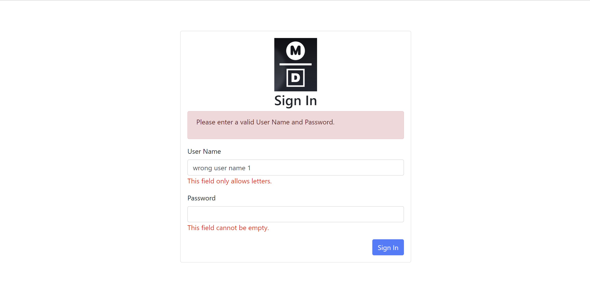
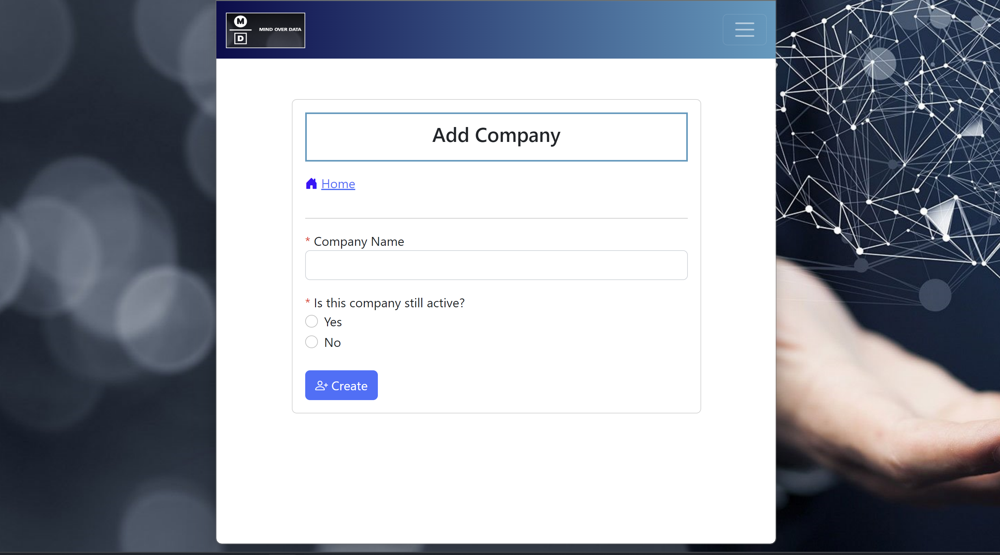
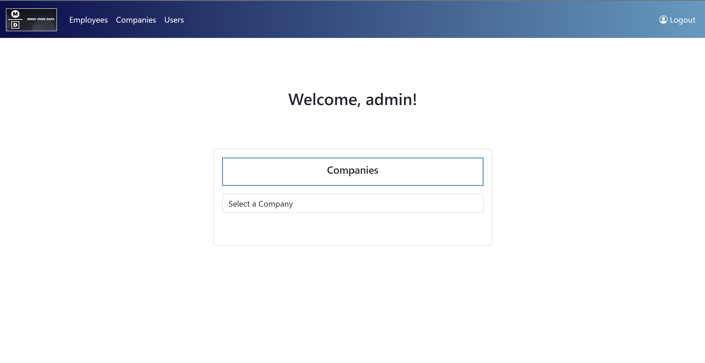
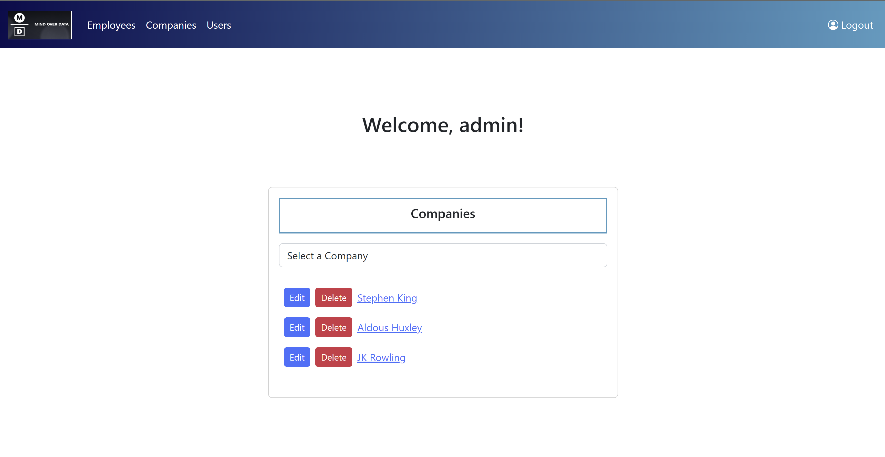

# ContentManager

## Table of Contents
1. [Functionality Screenshots](#functionality-screenshots)
2. [Application Description](#application-description)
3. [Technologies Used](#technologies-used)
4. [Developer Information](#developer-information) 

## Functionality Screenshots

Input Validation           |  Responsiveness           
:-------------------------:|:-------------------------:
  |  

Sleek, modern design       |  Intuitive usability             
:-------------------------:|:-------------------------:
  |  

[Back to Table of Contents](#table-of-contents)

## Application Description

This is a small, but growing web application designed as an interface to perform CRUD 
(create, read, update, delete) operations on a custom-built MSSMS database. The application demonstrates advanced
enterprise development techniques like client-side and server-side input validation, security interceptors, responsiveness, OOP, MVC, session management, utilization of services, gateways, and domains, datatables, modals, user privilege managment, and various security focused 
techniques like implementation of SQL query parameters. 

[Back to Table of Contents](#table-of-contents)

## Technologies Used
- ColdFusion Markup Language (CFML)
- Some custom CSS and JavaScript
- Bootstrap, jQuery
- ColdBox MVC framework
- SQL/Micorsoft SQL Server Management Studio
- CommandBox/Lucee server
- Visual Studio Code IDE

[Back to Table of Contents](#table-of-contents)

## Developer Information
Programmed by Andrew B. Schaefer [(Ab0213ab)](https://github.com/Ab0213ab).

LinkedIn: https://www.linkedin.com/in/andrewbschaefer/

Email: Abs233abs@gmail.com 

[Back to Table of Contents](#table-of-contents)

