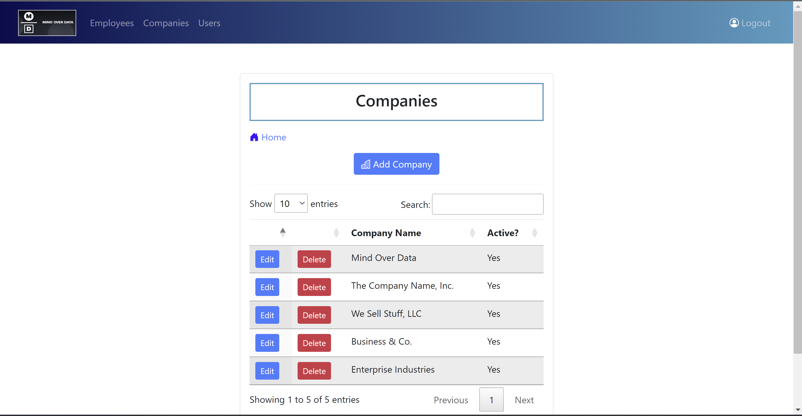

# ContentManager

## Table of Contents
1. [Functionality Screenshots](#functionality-screenshots)
2. [Application Description](#application-description)
3. [Technologies Used](#technologies-used)
4. [Developer Information](#developer-information) 

## Functionality Screenshots

Credential Authorization/Input Validation   |  Responsiveness           
:-------------------------:|:-------------------------:
  |  

Sleek, modern design       |  Intuitive usability             
:-------------------------:|:-------------------------:
  |  

BootStrap Front-End Techniques   |  jQuery DataTables           
:-------------------------:|:-------------------------:
  |  

Full CRUD Operation Support   |  "           
:-------------------------:|:-------------------------:
  |  

[Back to Table of Contents](#table-of-contents)

## Application Description

This is a small, but growing web application designed as an interface to perform CRUD 
(create, read, update, delete) operations on a custom-built MSSMS database. The application demonstrates many advanced
enterprise development techniques including, but not limited to: 
<ul>
	<li>client-side and server-side input validation</li> 
	<li>Security interceptors</li>
	<li>Responsiveness</li>
	<li>OOP</li> 
	<li>Poper MVC</li>
	<li>Session management</li> 
	<li>Utilization of services, gateways, and domains</li> 
	<li>jQuery Datatables</li>
	<li>Bootstrap modals</li> 
	<li>User privilege managment</li> 
	<li>And security focused techniques like SQL query parameter usage</li> 
</ul>

[Back to Table of Contents](#table-of-contents)

## Technologies Used
- ColdFusion Markup Language (CFML)
- Some custom CSS and JavaScript
- Bootstrap, jQuery
- ColdBox MVC framework
- SQL/Micorsoft SQL Server Management Studio
- CommandBox/Lucee server
- Visual Studio Code IDE

[Back to Table of Contents](#table-of-contents)

## Developer Information
Programmed by Andrew B. Schaefer [(Ab0213ab)](https://github.com/Ab0213ab).

LinkedIn: https://www.linkedin.com/in/andrewbschaefer/

Email: Abs233abs@gmail.com 

[Back to Table of Contents](#table-of-contents)

